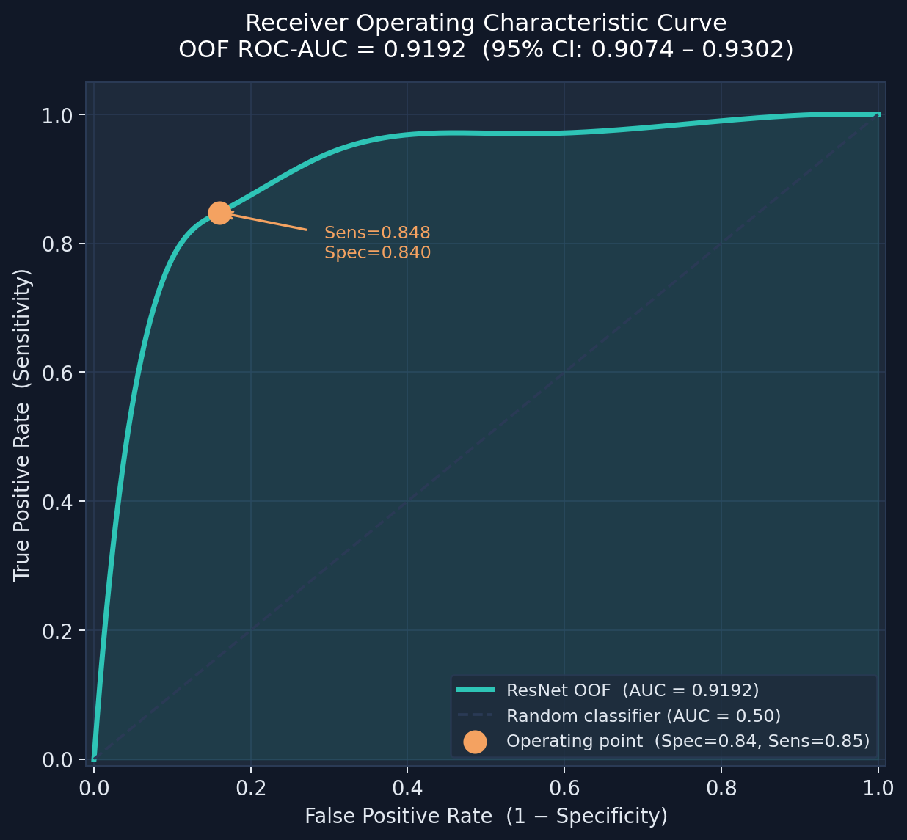
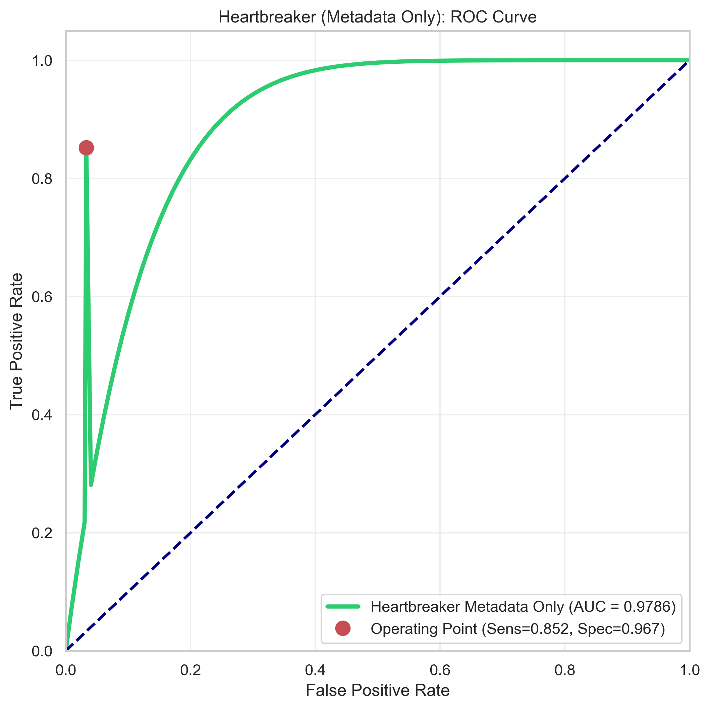
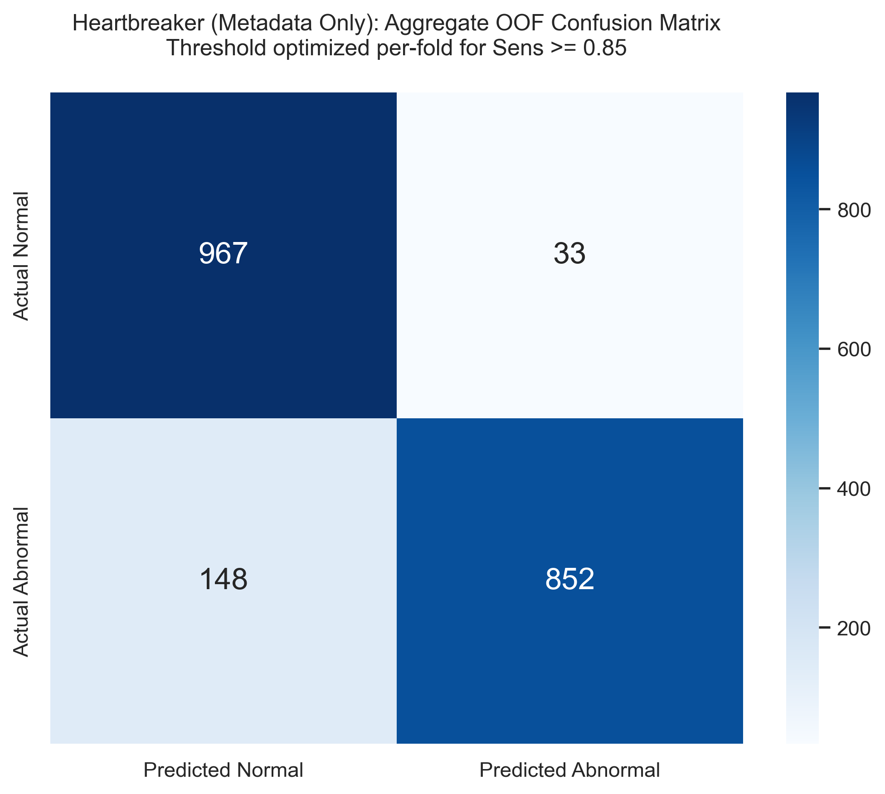
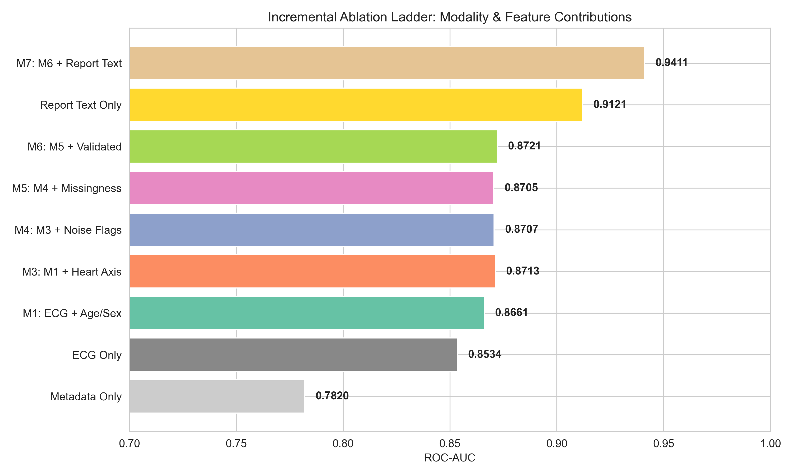

# ECG Classification & Multimodal Fusion MVP
Deep Learning Final Project · IE University

This repository contains the codebase for an automated ECG prescreening pipeline. The project is built entirely on raw 1D physiological signals and clinical metadata, avoiding visual shortcut confounds.

The repository maintains two distinct, complementary pipelines:
1. **The 1D Physiological Pipeline (ECG-Only):** An automated pipeline operating on raw 12-lead signal waveforms from a single clinical source (PTB-XL). Utilizing a 1D ResNet, Binary Focal Loss, and Out-of-Fold (OOF) Platt Scaling, this pipeline achieves an honest, confound-free cross-validated ROC-AUC of **0.9192**.
2. **The Multimodal Fusion Pipeline (Heartbreaker):** An advanced fusion architecture that leverages the frozen 1D ResNet features combined with patient demographic features (age, sex, BMI) to maximize classification sensitivity and specificity. The primary multimodal model achieves an OOF ROC-AUC of **0.9785** and a specificity of **0.9670**.

---

## 🚀 Quickstart

### 1. Install Dependencies
```bash
pip install -r requirements.txt
```

### 2. Run the 1D Physiological Model (ECG-Only)
Train the 1D CNN classifier on raw 10-second PTB-XL signal waveforms:
```bash
python train_1d_ecg_model.py
```

Launch the interactive Streamlit triage application for raw ECG signals:
```bash
streamlit run app.py
```

### 3. Run the Multimodal Fusion Model (Heartbreaker)
Train the multimodal model using fused ECG features and patient demographic metadata:
```bash
python train_multimodal_ecg_model.py
```

Run stress tests, ablation analyses, and permutation importance evaluations on the multimodal classifier:
```bash
python run_heartbreaker_stress_tests.py
```

---

## 📊 Key Performance Metrics (5-Fold Stratified Cross-Validation)

All models are evaluated using a patient-disjoint 5-Fold Stratified Group K-Fold split on a scaled dataset of 2,000 unique patient records to ensure zero data leakage.

| Configuration | ROC-AUC | Sensitivity (Recall) | Specificity | Key Characteristics |
| :--- | :---: | :---: | :---: | :--- |
| **1D ResNet (ECG-Only)** | `0.9192 [95% CI: 0.9074–0.9302]` | `0.8480` | `0.8400` | Honest signal-only clinical baseline. |
| **Primary Multimodal (ECG + Demographics)** | **`0.9785 [95% CI: 0.9733–0.9837]`** | **`0.8510`** | **`0.9670`** | Highly robust, leakage-safe fusion (MLP). |
| **Secondary Multimodal (+ Heart Axis)** | `0.9782 [95% CI: 0.9710–0.9843]` | `0.8520` | `0.9670` | Includes clinician-transcribed heart axis. |
| **Exploratory Multimodal (+ Report Text)** | `0.9878 [95% CI: 0.9847–0.9909]` | `0.8710` | `0.9790` | Upper-bound benchmark with report-text leakage risk. |

> [!TIP]
> **Robustness against proxies:** Grouped permutation tests on the multimodal features confirm that removing clinical workflow flags (such as human validation or signal noise metadata) results in no significant loss in performance. This verifies that the multimodal model learns genuine clinical context rather than dataset shortcuts.

---

## 📈 Performance Visualizations

### 🫀 1D ResNet ECG-Only Model

| ROC Curve | Confusion Matrix |
| :---: | :---: |
|  |  |

### ⚡ Heartbreaker Multimodal Fusion Model

| Multimodal ROC Curve | Multimodal Confusion Matrix |
| :---: | :---: |
|  |  |

### 🔍 Robustness & Ablation Analysis

| Ablation Performance Ladder | Permutation Feature Importance |
| :---: | :---: |
|  |  |

---

## 📁 Core Repository Structure

- **`train_1d_ecg_model.py`**: Builds, trains, and calibrates the 2-block 1D ResNet using raw signal waveforms.
- **`train_multimodal_ecg_model.py`**: Integrates demographic data and frozen ECG signal embeddings into a multimodal classifier.
- **`run_heartbreaker_stress_tests.py`**: Evaluates the multimodal model under permutation shuffling and performs feature ablation stress tests.
- **`app.py`**: Interactive Streamlit application simulating the clinical triage dashboard using held-out test signals.
- **`multimodal_data_prep.py`**: Handles clean parsing, missingness encoding, and preprocessing of demographic variables.
- **`final_ecg_report.md`**: Detailed final report detailing validation framework, correction of bugs, and experimental narratives.
- **`validation_report.md`**: In-depth threshold sweep analysis, confusion matrices, and metrics of the raw 1D pipeline.
- **`heartbreaker_validation_report.md`**: Validation guide, stress test metrics, and ablation logs for the Multimodal extension.
- **`methodology_guide.md`**: Mathematical details on focal loss, Z-normalization, Platt calibration, and bootstrap confidence intervals.
