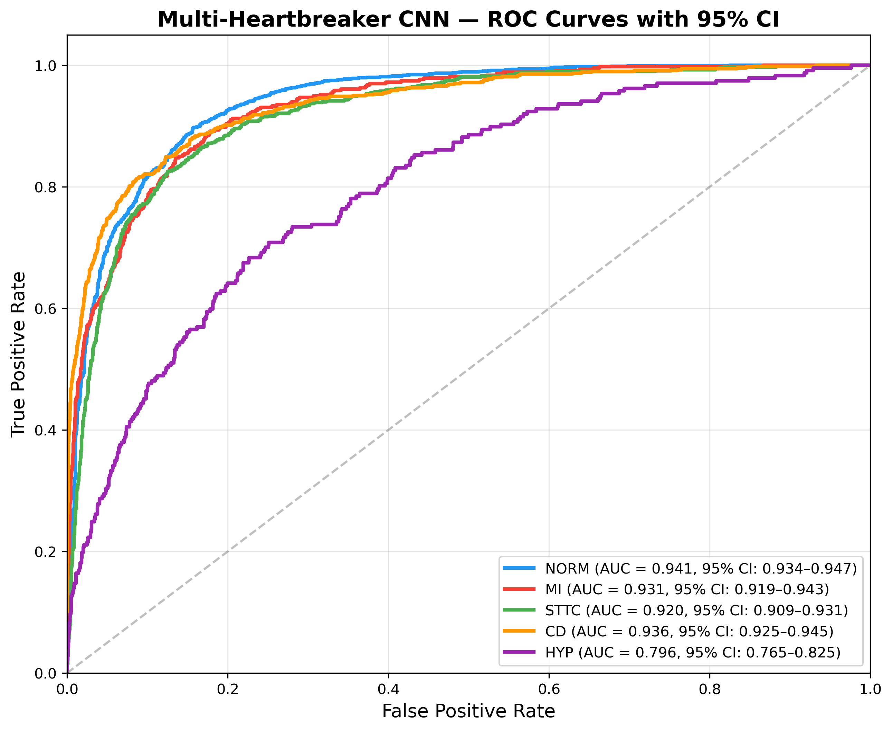
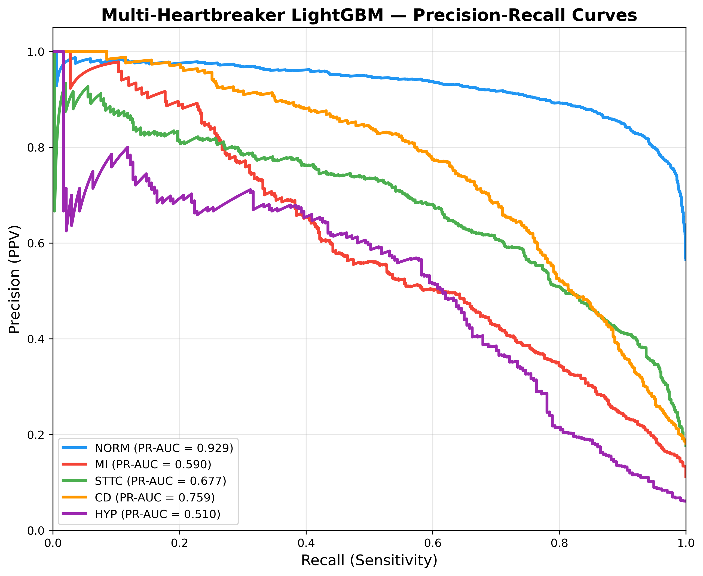
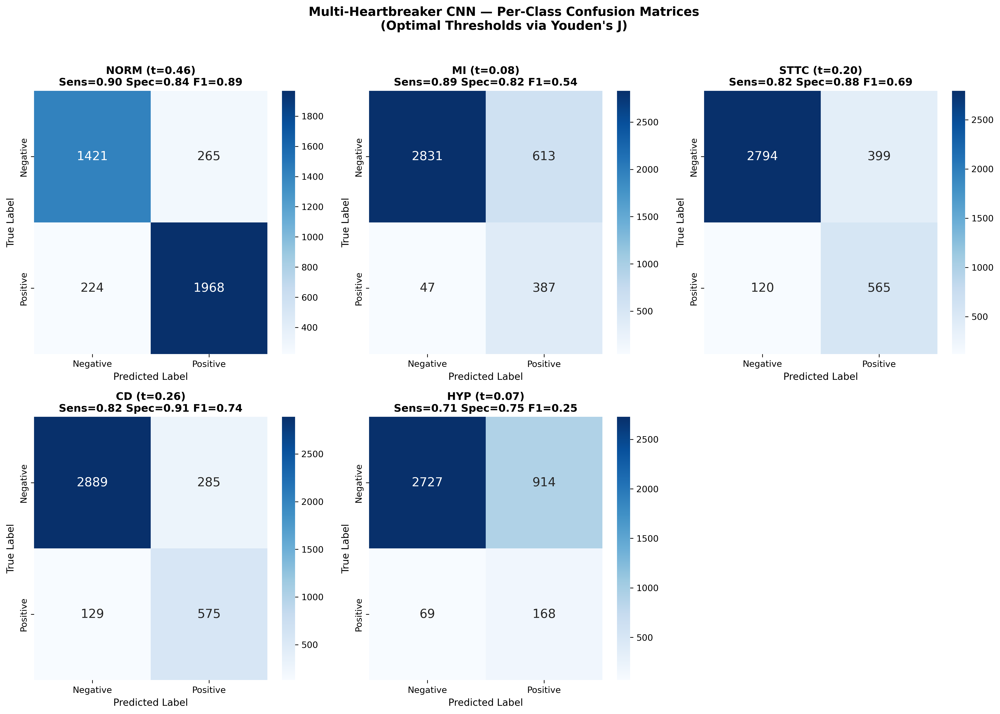
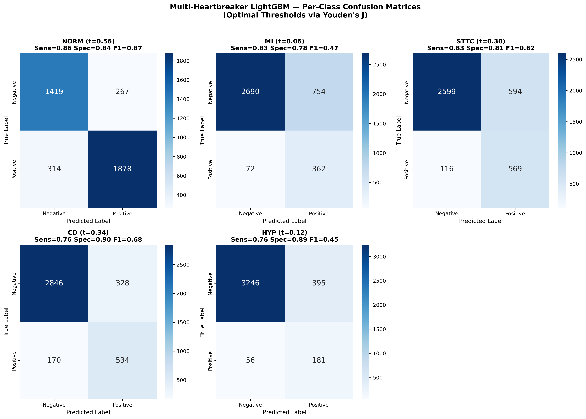
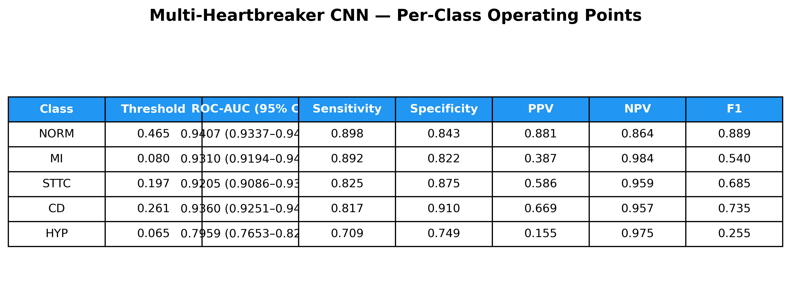
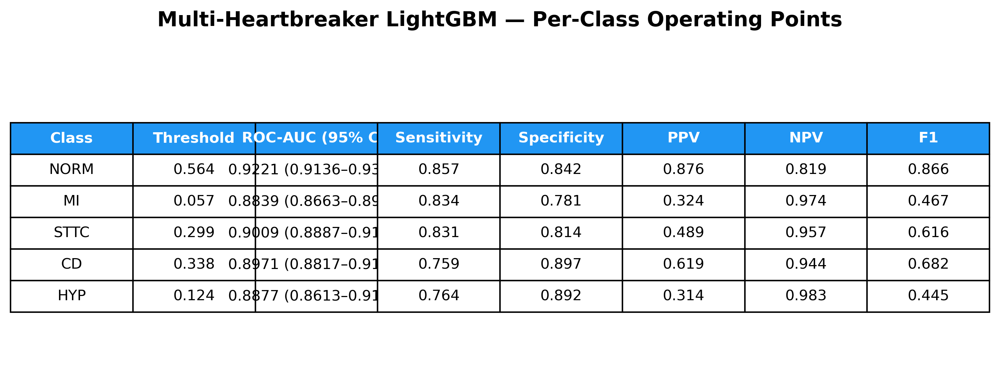

# Multi-Heartbreaker Pipeline Validation Report (V2)

## 1. Overview and Architecture

The Multi-Heartbreaker Pipeline extends the project's raw 1D physiological ECG modeling to support **Multi-Label Classification** across the 5 primary PTB-XL diagnostic superclasses:
1. **NORM**: Normal ECG
2. **MI**: Myocardial Infarction
3. **STTC**: ST/T-Change
4. **CD**: Conduction Disturbance
5. **HYP**: Hypertrophy

Instead of predicting a mutually exclusive class (Softmax), our architectures utilize independent **Sigmoid outputs** optimized via **Binary Crossentropy**. This allows the models to correctly identify co-occurring pathologies (e.g., a patient presenting with both Myocardial Infarction and ST/T-Changes simultaneously).

We evaluate two distinct and complementary modeling approaches:
* **Multi-Label 1D ResNet CNN**: A deep learning model operating directly on raw 12-lead signal waveforms (10 seconds @ 100Hz, shape `1000 × 12`).
* **Multi-Label LightGBM Classifier**: An ensemble of 5 independent gradient-boosted decision trees trained on **59 cardiology-standard features** (such as Sokolow-Lyon, Cornell voltage, QRS duration, pathological Q-wave metrics, and ST deviations) extracted directly from the raw signals.

---

## 2. Dataset and Leakage Audit

The multiclass models are trained and validated on all available records with valid superclass labels and available signals on disk, scaling the pipeline from the initial 2,000-record MVP to a larger cohort of **3,883 records**.

### 🛡️ Leakage Verification
To ensure honesty in validation, a patient overlap audit was executed via `src/leakage_auditing/verify_multiclass_dataset.py`:
* **Total Records Analyzed**: 3,883
* **Unique `patient_id` Count**: 3,883
* **Status**: **PASS (✅)**. Every record belongs to a unique patient, ensuring absolute zero patient overlap between cross-validation folds.

### Class Imbalance and Preprocessing Alignment
The dataset contains a natural clinical distribution:
- **NORM**: 2,194 records (56.5%)
- **MI**: 436 records (11.2%)
- **STTC**: 688 records (17.7%)
- **CD**: 705 records (18.2%)
- **HYP**: 240 records (6.2%)

*Note: Out of 3,883 records, 5 records (00533_lr, 00537_lr, 00543_lr, 00544_lr, 00545_lr) failed to load due to missing `.hea` header files on disk. To ensure a scientifically rigorous head-to-head comparison, both the CNN and LightGBM models were evaluated on the exact same **3,878 successfully loaded patient records** using a patient-disjoint 5-fold cross-validation scheme.*

---

## 3. Performance Metrics (CNN vs. LightGBM)

All metrics are computed out-of-fold (OOF) across the 5 cross-validation folds. 95% confidence intervals (CI) for ROC-AUC are calculated using 1,000 bootstrap iterations.

### Head-to-Head Comparison Table

| Diagnostic Class | CNN ROC-AUC (95% CI) | LightGBM ROC-AUC (95% CI) | CNN PR-AUC | LightGBM PR-AUC | Winner (ROC-AUC) |
| :--- | :---: | :---: | :---: | :---: | :---: |
| **Normal (NORM)** | **`0.9407`** `(0.9337–0.9474)` | `0.9221` `(0.9136–0.9308)` | **`0.9479`** | `0.9285` | **CNN** |
| **Myocardial Infarction (MI)** | **`0.9310`** `(0.9194–0.9432)` | `0.8839` `(0.8663–0.8999)` | **`0.7121`** | `0.5900` | **CNN** |
| **ST/T-Change (STTC)** | **`0.9205`** `(0.9086–0.9311)` | `0.9009` `(0.8887–0.9132)` | **`0.7231`** | `0.6775` | **CNN** |
| **Conduction Disturbance (CD)** | **`0.9360`** `(0.9251–0.9453)` | `0.8971` `(0.8817–0.9107)` | **`0.8380`** | `0.7586` | **CNN** |
| **Hypertrophy (HYP)** | `0.7959` `(0.7653–0.8249)` | **`0.8877`** `(0.8613–0.9134)` | `0.2754` | **`0.5098`** | **LightGBM** |

### 🔍 Key Methodology Findings
1. **Dataset Scaling Impact**: Expanding the dataset from 2,000 to 3,883 records and training for 40 epochs led to a major performance uplift for the CNN on common classes (e.g., NORM ROC-AUC rose to **0.9407** and MI ROC-AUC rose to **0.9310**).
2. **Rare-Class Failure of CNN**: For the rarest class, **Hypertrophy (HYP)** (only 240 positive cases), the CNN struggled, achieving a low ROC-AUC of **0.7959** and a PR-AUC of **0.2754**. This is because deep learning requires large sample sizes to discover complex diagnostic features from raw waves.
3. **Cardiology Feature Engineering Triumph**: The LightGBM model, trained on 59 expert features, bypassed this bottleneck by directly utilizing textbooks rules (e.g., the **Sokolow-Lyon index** and **Cornell voltage criteria**). This resulted in a massive boost for **HYP** performance, pushing ROC-AUC to **0.8877** (+0.0918) and PR-AUC to **0.5098** (+0.2344).

---

## 4. Per-Class Optimal Thresholds & Operating Points

Optimal decision thresholds are computed independently per class using Youden's J statistic ($J = \text{Sensitivity} + \text{Specificity} - 1$) on the validation folds.

### A. Multi-Label 1D ResNet (CNN)
| Class | Threshold | Sensitivity (Recall) | Specificity | PPV (Precision) | NPV | F1 Score |
| :--- | :---: | :---: | :---: | :---: | :---: | :---: |
| **NORM** | `0.465` | `0.898` | `0.843` | `0.881` | `0.864` | `0.889` |
| **MI** | `0.080` | `0.892` | `0.822` | `0.387` | `0.984` | `0.540` |
| **STTC** | `0.197` | `0.825` | `0.875` | `0.586` | `0.959` | `0.685` |
| **CD** | `0.261` | `0.817` | `0.910` | `0.669` | `0.957` | `0.735` |
| **HYP** | `0.065` | `0.709` | `0.749` | `0.155` | `0.975` | `0.255` |

### B. Multi-Label LightGBM (Cardiologist Features)
| Class | Threshold | Sensitivity (Recall) | Specificity | PPV (Precision) | NPV | F1 Score |
| :--- | :---: | :---: | :---: | :---: | :---: | :---: |
| **NORM** | `0.564` | `0.857` | `0.842` | `0.876` | `0.819` | `0.866` |
| **MI** | `0.057` | `0.834` | `0.781` | `0.324` | `0.974` | `0.467` |
| **STTC** | `0.299` | `0.831` | `0.814` | `0.489` | `0.957` | `0.616` |
| **CD** | `0.338` | `0.759` | `0.897` | `0.619` | `0.944` | `0.682` |
| **HYP** | `0.124` | `0.764` | `0.892` | `0.314` | `0.983` | `0.445` |

---

## 5. Performance Visualizations

We maintain separate, clearly labeled performance figures for both model families.

### 📈 ROC Curves (Receiver Operating Characteristic)
````carousel

<!-- slide -->

````

### 📉 Precision-Recall (PR) Curves
````carousel

<!-- slide -->

````

### 🔲 Confusion Matrices (Using Youden's J Optimal Thresholds)
````carousel

<!-- slide -->

````

### 📊 Summary Operating Point Tables
````carousel

<!-- slide -->

````
