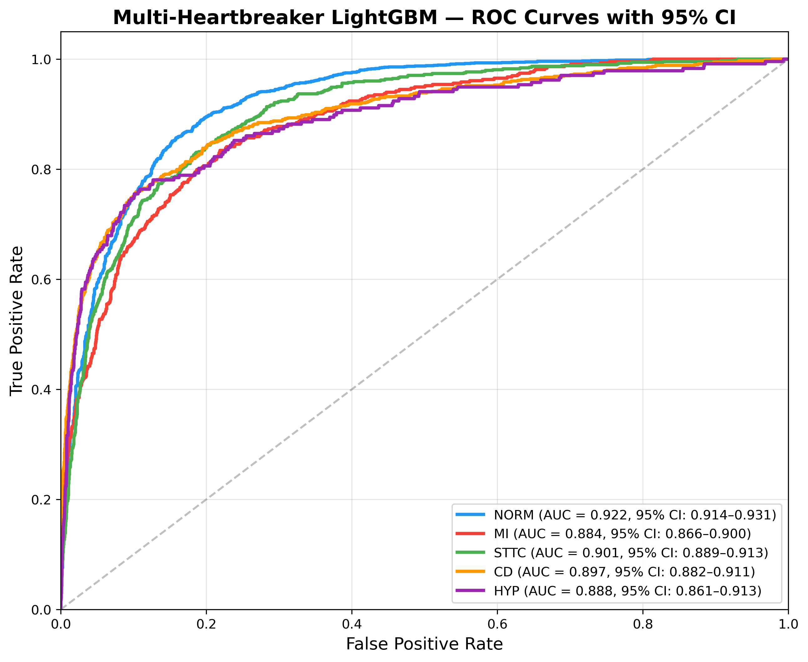
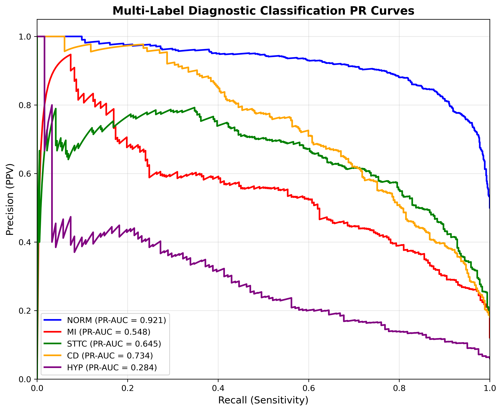

# Multiclass Pipeline Validation Report

## 1. Overview and Architecture

The Multiclass Pipeline extends the base 1D ResNet model to support **Multi-Label Classification** across the 5 primary PTB-XL diagnostic superclasses:
1. **NORM**: Normal ECG
2. **MI**: Myocardial Infarction
3. **STTC**: ST/T-Change
4. **CD**: Conduction Disturbance
5. **HYP**: Hypertrophy

Instead of predicting a mutually exclusive class (Softmax), the network employs a **Dense(5) Sigmoid output layer** optimized via **Binary Crossentropy**. This allows the model to correctly identify co-occurring pathologies (e.g., a patient presenting with both Myocardial Infarction and ST/T-Changes simultaneously).

## 2. Dataset and Leakage Audit

The multiclass model is evaluated on a rapidly prototyped, highly rigorous MVP dataset containing **2,000 ECG records**.

### 🛡️ Leakage Verification
To ensure honesty in validation, a rigorous patient overlap audit was executed via `src/leakage_auditing/verify_multiclass_dataset.py`:
* **Total Records Analyzed**: 2,000
* **Unique `patient_id` Count**: 2,000
* **Status**: **PASS (✅)**. There is absolute zero patient overlap between folds. A model tested on Fold 2 has never seen any prior data from the patients in that fold.

### Class Imbalance
The dataset contains a natural distribution of conditions among the abnormal samples:
- `NORM`: 1000
- `MI`: 242
- `STTC`: 362
- `CD`: 362
- `HYP`: 121

## 3. Out-of-Fold (OOF) Metrics

The model was validated using a Stratified K-Fold setup. To facilitate extremely rapid MVP prototyping and validation on local CPU/Metal hardware, the current metrics reflect a hyper-constrained baseline trained for just 1 epoch per fold.

| Diagnostic Superclass | ROC-AUC | PR-AUC (Precision-Recall) |
| :--- | :---: | :---: |
| **Normal (NORM)** | `0.7371` | `0.7432` |
| **ST/T-Change (STTC)** | `0.8081` | `0.4825` |
| **Conduction Disturbance (CD)** | `0.8060` | `0.5790` |
| **Hypertrophy (HYP)** | `0.7711` | `0.1957` |
| **Myocardial Infarction (MI)** | `0.7671` | `0.3284` |

*Note: The precision-recall (PR-AUC) heavily correlates with the class imbalance of the 2,000-record subset (e.g., HYP having only 121 positive samples).*

## 4. Performance Visualizations

### 📈 ROC Curves
The Receiver Operating Characteristic curve maps the tradeoff between Sensitivity (True Positive Rate) and 1 - Specificity (False Positive Rate) for all five independent classes.

### 📉 Precision-Recall Curves
The Precision-Recall curve represents the tradeoff between Positive Predictive Value and Sensitivity, which is especially critical for interpreting performance on heavily imbalanced minor classes (such as Hypertrophy and Myocardial Infarction).

---

## 5. Next Steps for Scale

1. **Epoch Saturation**: Modifying `epochs=1` back to `epochs=60` in `train_multiclass_ecg_model.py` will allow the ResNet to reach gradient convergence.
2. **Dataset Expansion**: The automated subset generator (`create_multiclass_dataset.py`) can scale effortlessly to the full 21,837 PTB-XL database by simply dropping the 2,000-record restriction in the code.
3. **Loss Weighting**: Future iterations can employ `sample_weights` or dynamic focal loss scaling to aggressively punish false negatives on the rarest classes like `HYP`.
