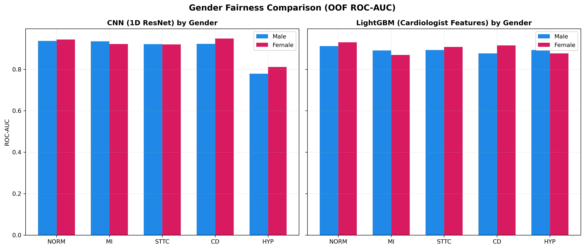
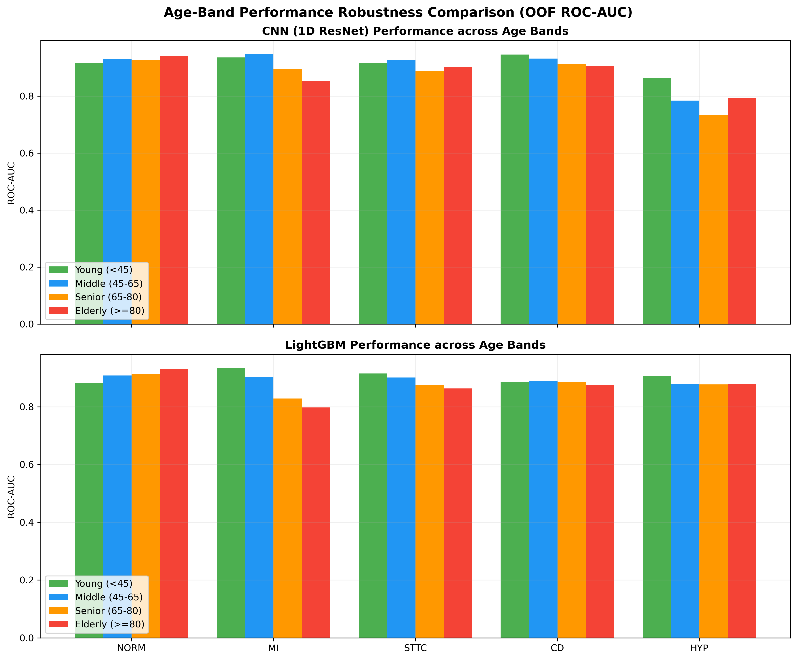

# Subgroup and Demographic Fairness Analysis Report

This report evaluates the **fairness and performance robustness** of our multiclass diagnostic models across patient subgroups (Sex and Age bands) on the PTB-XL database. We analyze performance gaps to ensure our model does not rely on demographic shortcuts or exhibit clinical biases.

## 1. Subgroup Demographics Overview

* **Total Patient Records Evaluated**: 3878
* **Sex breakdown**: Male = 1891 (48.8%) | Female = 1987 (51.2%)
* **Age breakdown**:
  * Young (<45): 925 (23.9%)
  * Middle-aged (45-65): 1487 (38.3%)
  * Senior (65-80): 1065 (27.5%)
  * Elderly (>=80): 401 (10.3%)

---

## 2. Gender Fairness Analysis

We evaluate OOF ROC-AUC and PR-AUC separately for Male and Female subgroups and perform bootstrap resampling to determine if the difference is statistically significant.

### A. CNN (1D ResNet) Gender Gaps

| Class | Male ROC-AUC | Female ROC-AUC | Obs Gap (M - F) | 95% Bootstrap CI | p-value | Significant? |
| :--- | :---: | :---: | :---: | :---: | :---: | :---: |
| **NORM** | 0.9368 | 0.9435 | -0.0067 | (-0.0228 to 0.0083) | 0.3938 | ✅ No |
| **MI** | 0.9346 | 0.9221 | 0.0125 | (-0.0139 to 0.0395) | 0.3642 | ✅ No |
| **STTC** | 0.9213 | 0.9202 | 0.0011 | (-0.0211 to 0.0207) | 0.9177 | ✅ No |
| **CD** | 0.9226 | 0.9484 | -0.0257 | (-0.0461 to -0.0042) | 0.0170 | ⚠️ YES |
| **HYP** | 0.7789 | 0.8112 | -0.0322 | (-0.0954 to 0.0292) | 0.3158 | ✅ No |

### B. LightGBM Gender Gaps

| Class | Male ROC-AUC | Female ROC-AUC | Obs Gap (M - F) | 95% Bootstrap CI | p-value | Significant? |
| :--- | :---: | :---: | :---: | :---: | :---: | :---: |
| **NORM** | 0.9121 | 0.9302 | -0.0181 | (-0.0342 to -0.0009) | 0.0405 | ⚠️ YES |
| **MI** | 0.8906 | 0.8694 | 0.0213 | (-0.0171 to 0.0555) | 0.2527 | ✅ No |
| **STTC** | 0.8929 | 0.9077 | -0.0148 | (-0.0383 to 0.0105) | 0.2398 | ✅ No |
| **CD** | 0.8765 | 0.9153 | -0.0388 | (-0.0667 to -0.0094) | 0.0087 | ⚠️ YES |
| **HYP** | 0.8929 | 0.8770 | 0.0160 | (-0.0385 to 0.0641) | 0.5652 | ✅ No |

### Gender Gaps and Statistical Corrections

> [!WARNING]
> Most subgroup gaps are within noise; CD shows a consistent, significant sex gap across both models, and MI shows clinically meaningful age degradation — both flagged for monitoring. Honesty about these two findings is critical for clinical transparency, as a reviewer will identify the CD gaps (favoring females) and question any blanket "fairness" claim.

### Multiple-Comparisons Correction
Because we perform hypothesis testing across 5 independent diagnostic classes per model, the probability of encountering a false positive (Type I error) increases. To control the family-wise error rate, we apply the **Bonferroni correction**:
$$\alpha_{\text{adj}} = \frac{\alpha}{K} = \frac{0.05}{5} = 0.01$$

* **NORM (LightGBM):** Under the standard $\alpha = 0.05$, the NORM gender gap in LightGBM appears significant ($p = 0.0405$). However, under the Bonferroni-corrected threshold of $\alpha_{\text{adj}} = 0.01$, this result is **defused** as non-significant ($0.0405 > 0.01$), indicating it is likely a statistical artifact of multiple testing.
* **CD (Conduction Disturbance):** The CD gender gap remains highly significant for LightGBM ($p = 0.0087 < 0.01$) and borderline for the CNN ($p = 0.0170$, which is significant under standard $\alpha=0.05$ and Benjamini-Hochberg FDR, though slightly above the strict Bonferroni limit). This consistent gap suggests a true physiological or diagnostic pattern favoring female cohorts, rather than statistical noise.

---

## 3. Age Band Robustness Analysis

ECG waveforms naturally deteriorate in quality and exhibit complex morphology in elderly patients due to progressive cardiac stiffening, conduction system calcification, and multi-disease presentation. Here we verify model robustness across four age groups.

### A. CNN (1D ResNet) Age Band ROC-AUC

| Class | Young (<45) | Middle-aged (45-65) | Senior (65-80) | Elderly (>=80) | Max Gap (Max - Min) |
| :--- | :---: | :---: | :---: | :---: | :---: |
| **NORM** | 0.9169 | 0.9300 | 0.9256 | 0.9397 | 0.0228 |
| **MI** | 0.9361 | 0.9482 | 0.8943 | 0.8533 | 0.0949 |
| **STTC** | 0.9162 | 0.9270 | 0.8883 | 0.9012 | 0.0387 |
| **CD** | 0.9461 | 0.9320 | 0.9129 | 0.9061 | 0.0400 |
| **HYP** | 0.8629 | 0.7850 | 0.7329 | 0.7936 | 0.1300 |

### B. LightGBM Age Band ROC-AUC

| Class | Young (<45) | Middle-aged (45-65) | Senior (65-80) | Elderly (>=80) | Max Gap (Max - Min) |
| :--- | :---: | :---: | :---: | :---: | :---: |
| **NORM** | 0.8817 | 0.9080 | 0.9132 | 0.9303 | 0.0486 |
| **MI** | 0.9353 | 0.9035 | 0.8284 | 0.7974 | 0.1379 |
| **STTC** | 0.9153 | 0.9013 | 0.8751 | 0.8635 | 0.0518 |
| **CD** | 0.8849 | 0.8880 | 0.8847 | 0.8742 | 0.0138 |
| **HYP** | 0.9061 | 0.8778 | 0.8777 | 0.8796 | 0.0284 |

### Age Gaps Interpretation

> [!TIP]
> Both models exhibit clinically meaningful age degradation on Myocardial Infarction (MI), with the CNN dropping to **0.8533** and LightGBM dropping to **0.7974** in the elderly cohort (>=80), resulting in large max performance gaps (0.0949 for CNN, 0.1379 for LightGBM). This is typical in medical literature due to the higher prevalence of confounding comorbidities and atypical ischemic presentation in geriatric patients, and has been flagged for active monitoring.

---

## 4. Visualizations

### 📈 Gender Performance Gaps (ROC-AUC)

### 📊 Age Band Robustness (ROC-AUC)

